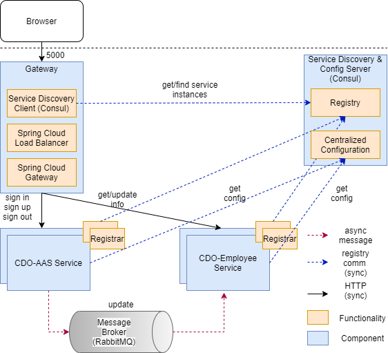

# Introduction 
"Capability Development System“ is a sub module of the internal CRM
+ Manage and define career paths
+ Manage and suggest training plans
# Architecture

# Requirements
* JDK 
* Node.js 
* npm 
* RabbitMQ 
* Consul 

# I. For Developer
# Back-end
1. You need a PostGreSQL server running. Install and run PostGreSQL according to your OS with username=postgres, password=Abcd1234, database=postgres
	- Install and start postgres server on windows:
		- Download postgres binary from https://www.enterprisedb.com/download-postgresql-binaries and extract it
		    ```bash
			cd pgsql\bin
			```
		- initialize database with password Abcd1234
			```bash
			initdb -D ..\pgdata -U postgres -W -E UTF8 -A scram-sha-256
			```		 
		- start database:  
			```bash
			pg_ctl -D ..\pgdata -l logfile start
			```
	- Install and start postgres  for other operating system:
		- https://www.postgresql.org/download/
		
2. You also need Consul up and running (in development mode). 
	- Install and start postgres server on windows:
		- Download postgres binary from https://www.consul.io/downloads and extract it
		- Start consul
			```bash
			consul agent -node=cdo-consul -dev -client 0.0.0.0
			```
			
3. Start the Gateway service (spring boot project)
	- Download source: http://tfs.logigear.com/MWD/_git/CDO
		```bash
		cd gateway
		```
	- Run project either SpringToolSuite4 or command as following
		```bash
		./mvnw spring-boot:run
		```

4. Start the crm-certification-service service (spring boot project)
	- Download source: http://tfs.logigear.com/MWD/_git/CDO
		```bash
		cd crm-certification-service
		```
	- Run project either SpringToolSuite4 or command as following
		```bash
		./mvnw spring-boot:run
		```
5. Start the crm-employees-service service (spring boot project)
	- Download source: http://tfs.logigear.com/MWD/_git/CDO
		```bash
		cd crm-employees-service
		```
	- Run project either SpringToolSuite4 or command as following
		```bash
		./mvnw spring-boot:run
		```
# Notes
If ./mvnw spring-boot:run could not run, please install mvn wrapper:
    ```bash
    cdo-aas$ mvn -N io.takari:maven:wrapper
    ```

# Front-end
Front-end is a webserver run at port 4200
1. The Angular application can be started with npm. First, you need to download the dependencies with:
    ```bash
    crm-app-client$ npm install
    ```
2. Then, you start the server with:
    ```bash
    crm-app-client$ npm start
    ```
	
# II. For Deployment
# Back-end
1. You need a PostGreSQL server running. Install and run PostGreSQL according to your OS with username=postgres, password=Abcd1234, database=postgres
	Note: If you want to access PostGreSQL from outsite loclahost, edit pg_hba.conf in the installed folder and edit following line:
	```
    # IPv4 local connections:
	host    all             all             all
    ```
	Install postgres server on windows:
		- Download postgres binary from https://www.enterprisedb.com/download-postgresql-binaries and extract it
		- cd pgsql\bin
		- initialize database: initdb -D ..\pgdata -U postgres -W -E UTF8 -A scram-sha-256 then enter password Abcd1234 (username is postgres)
		- start database:  pg_ctl -D ..\pgdata -l logfile start

2. You also need Consul up and running (in development mode). Follow the instructions for your OS, for example:
    ```bash
    $ consul agent -node=cdo-consul -dev -client 0.0.0.0
    ```
	Then edit the rabbitMQ address in global_config.json and import global configuration setting as following:
	```bash
    $ consul kv import @global_config.json
    ```
	Go to Consul web management at  http://localhost:8500 and edit rabbitMQ and PostGreSQL address then save it
	

3. You need a RabbitMQ server running. Run the server according to the instructions for your OS, for example:
    ```bash
    $ rabbitmq-server
    ```
	Open to rabbitMQ web manager at http://localhost:15672/, login with default user 'gues't (password: 'guest'). Create user 'hung' with password 'hung' as following:
    
	If you want to access your rabbitMQ server outside localhost, double click on created user and add permission for this user:
	

4. To start the Authentication&Authorization microservice, you must edit Consul configuration in application.yml 
	
    Then  use the command line with the included Maven wrapper:
    ```bash
    cdo-aas$ ./mvnw spring-boot:run
    ```
5. To start the Employee microservice, you must edit Consul configuration in application.yml as in step 4 and run the command line with the included Maven wrapper:
    ```bash
    cdo-employee$ ./mvnw spring-boot:run
    ```
6. To start the Gateway microservice, you must edit Consul configuration in application.yml as in step 4 and run the command line with the included Maven wrapper:
    ```bash
    gateway ./mvnw spring-boot:run
    ```
# Notes
If ./mvnw spring-boot:run could not run, please install mvn wrapper:
    ```bash
    cdo-aas$ mvn -N io.takari:maven:wrapper
    ```

# Front-end
Front-end is a webserver run at port 4200
1. The Angular application can be started with npm. First, you need to download the dependencies with:
    ```bash
    crm-app-client$ npm install
    ```
2. Then, you start the server with:
    ```bash
    crm-app-client$ npm start
    ```
